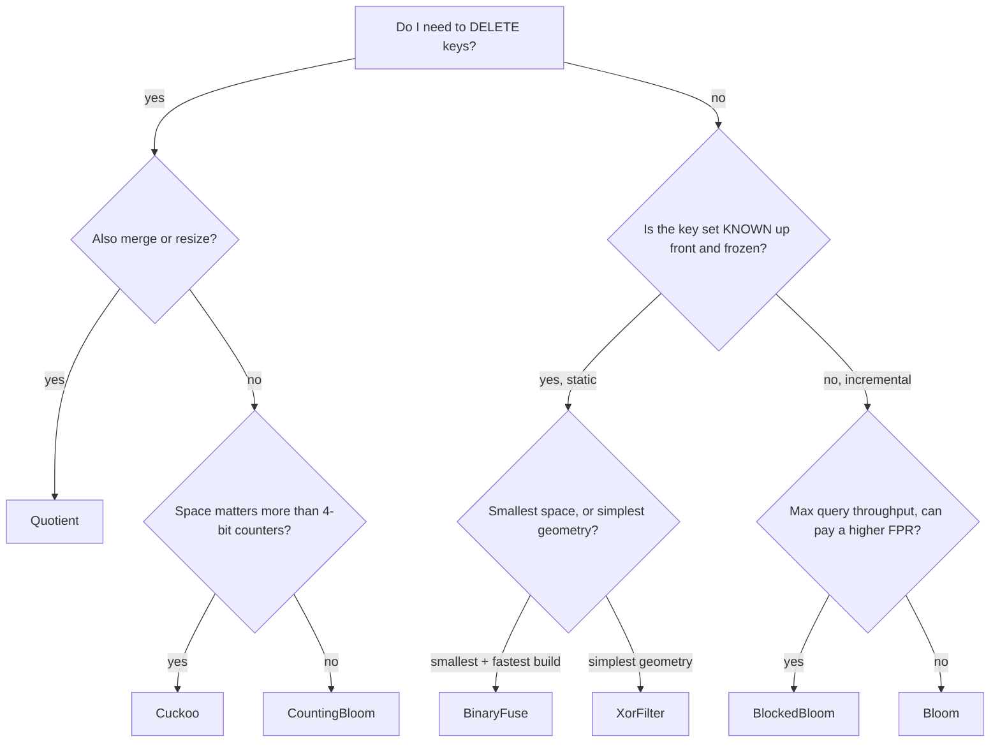

# Which filter do I pick? -- a field guide

> REPO-ONLY. This guide is NOT in the npm tarball (`package.json` `files[]`), exactly
> like lite-lru's `GUIDE.md`. The shipped `README.md` carries the concise table;
> `llms.txt` carries the per-member "good for / not for"; this is the long form with
> the flowchart and the MEASURED numbers.

The family is COMPLETE: 7 members under one `LiteFilter<K>` surface. Numbers below are
MEASURED by `npm run bench` on one machine at `cap=100000, fpp=0.01` -- an EXAMPLE, not a
headline. Run it on YOUR hardware and YOUR key distribution before trusting any row.

## The golden rule

**MEASURE your own keys.** The textbook `fpp = (1 - e^(-kn/m))^k` is a hypothesis,
not your filter's behavior. It assumes independent, uniform hash positions; under a
real key distribution -- especially near-full -- the MEASURED false-positive rate
runs OVER the formula. Every strong claim in this guide traces to a seeded bench
number produced by THIS repo (`npm run bench`). An overclaimed FPR or space bound is a
REJECT, not a headline.

```bash
npm run bench     # measured vs theoretical FPR, bits/item, add/query ns, per workload
```

## Two decision axes

Picking a member is really two questions, in order:

1. **Mutable vs static.** Does the key set change after you build it?
   - You ADD (and maybe DELETE) over time -> a MUTABLE member (Bloom, CountingBloom,
     BlockedBloom, Cuckoo, Quotient).
   - The set is KNOWN up front and frozen -> a STATIC member (XorFilter, BinaryFuse),
     which trades mutability for the smallest space and a guaranteed one build.
2. **Within static: XOR vs Binary Fuse (space/simplicity).** Both are static, immutable,
   byte-aligned, and peel a 3-uniform hypergraph.
   - **BinaryFuse** is SMALLER (~1.13x slots/item, ~9.0 bits/item at n=1e6) and FASTER to
     build -- the default static choice. Overlapping fuse segments (multiply-shift
     selection), Graf & Lemire 2022.
   - **XorFilter** is the SIMPLER geometry (3 equal disjoint segments, `hash % bl`), a
     touch larger (~1.23x, ~9.85 bits/item). Reach for it only if you want the plainer
     construction or are matching an existing XOR-filter layout; otherwise prefer Binary
     Fuse -- it is smaller AND faster with the same API and FPR.

## The decision table (each row a hypothesis to TEST, never a verdict)

Measured at cap=100000, fpp=0.01, uniform workload (`npm run bench`):

| Your need | Pick | bits/item | measured FPR | Why |
| --- | --- | --- | --- | --- |
| Simple, well-understood baseline | **Bloom** | 9.59 | 0.01004 | the textbook default; the one-sided floor |
| Need deletes | **CountingBloom** | 38.34 | 0.01004 | 4-bit counters decrement; real `remove()` |
| Need deletes at low space | **Cuckoo** | 20.97 | 0.00584 | fingerprints in 2 buckets; deletes, ~half CBF's space |
| Deletes + merge + resize | **Quotient** | 23.59 | 0.00581 | the only member that merges AND resizes |
| Maximum query throughput | **BlockedBloom** | 9.59 | 0.01415 | one cache miss/query (at a HIGHER measured FPR) |
| Known static set, simple geometry | **XorFilter** | 9.85 | 0.00383 | ~1.23x space, no inserts, plain `hash % bl` |
| Known static set, SMALLEST space | **BinaryFuse** | 9.50 | 0.00392 | ~1.13x space (9.04 b/item at 1e6), fastest build |

Space note: the bits/item column is measured at the bench cap (n=1e5). The STATIC members get
leaner as n grows and their fixed per-array overhead amortizes -- BinaryFuse measures ~9.04
bits/item at n=1e6 (the ~1.13x headline) and XorFilter ~9.85; the mutable members' bits/item is
effectively n-independent. So at scale BinaryFuse is the smallest member of all.

FPR notes: the mutable Bloom-family members deliver ~their configured `fpp`; Cuckoo /
Quotient / XOR / BinaryFuse are width-quantized to `2^-fw` (fw byte-aligned UP), so their
MEASURED rate typically lands UNDER the configured target -- the measure-vs-configured
honesty hook. BlockedBloom runs OVER plain Bloom (lost cross-block independence).

## The flowchart



## Per-member mental model

### Bloom -- the reference floor

One bit array of `m` bits, `k` hash positions per key. `add` sets `k` bits;
`mightContain` returns `true` only if all `k` bits are set. It is the ONE-SIDED floor: no
false negatives, false positives bounded by the configured `fpp`. It cannot delete
(clearing bits would break other keys), and it is not the most space-efficient at very low
`fpp` -- that is what the static members improve on. Reach for it when you want a simple,
predictable membership filter and do not need deletes.

### CountingBloom -- the deletable Bloom

Bloom with each bit replaced by a 4-bit SATURATING counter, two packed per byte
(decisions/0007): `add` increments, `remove` decrements, `mightContain` is true iff every
probed counter is nonzero. A real `remove(key) -> boolean` at ~4x a plain Bloom's space.
Two honest caveats:

- **Only remove keys you actually added.** A never-added key that is a false positive
  (all `k` counters nonzero via other keys) decrements REAL keys on removal and can cause
  a later false negative (decisions/0009).
- **Saturated counters stick.** A counter at 15 is clamped and never decremented
  (decisions/0008), so a key routed only through saturated counters stays present after
  removal. Negligibly rare at 1% fpp, but real.

### BlockedBloom -- the cache-local Bloom

Bloom partitioned into fixed 512-bit BLOCKS (64 bytes = one cache line, decisions/0012).
Every key routes to ONE block, all `k` bits live in that block, so a query touches ONE
cache line regardless of `k` -- the throughput win (query ns DOWN vs Bloom at the SAME
bits/item). Add-only: `remove()` throws. The caveat is inherent and MEASURED
(decisions/0013): confining a key to one block loses cross-block independence, so its
measured FPR runs OVER plain Bloom's for the same bits/item (0.01415 vs 0.01004 here).
`fpp()` reports the plain closed-form as a labeled FLOOR, not the delivered rate.

### Cuckoo -- fingerprints, deletes, low space

Stores a small nonzero FINGERPRINT per key in one of two candidate buckets of b=4 slots,
chosen by partial-key cuckoo hashing (decisions/0014). Deletes (`remove -> boolean`) at
roughly half a CountingBloom's space, with a width-quantized FPR (~2b/2^f). Fail-closed at
capacity: an insert that exhausts 500 kicks THROWS (never a silent drop). Same never-added
delete caveat as CountingBloom (decisions/0015).

### Quotient -- deletes, merge, resize

One open-addressed linear slot array; a key's hash splits into a QUOTIENT (home slot) and a
stored REMAINDER, with 3 metadata bits per slot (decisions/0016). The ONLY member that
`merge()`s and `resize()`s -- both reconstruct each element from its stored `(quotient,
remainder)` without the original keys. Deletes with a provably-correct shift-back repair.
Remainder-quantized FPR (`load * 2^-r`), fail-closed at the 0.90 load ceiling. Same
never-added delete caveat (decisions/0017).

### XorFilter -- static, simple geometry

The first STATIC member (decisions/0018-0020): built ONCE from a KNOWN key set by peeling a
3-uniform hypergraph -- each key touches 3 slots in 3 equal DISJOINT segments (`hash % bl`),
assigned so a key's 3 slots XOR to its fingerprint. No add/remove/clear (all throw).
Approaches the ~1.23x space bound (~9.85 bits/item at fw=8), width-quantized `2^-fw` FPR
UNDER the configured target. `from()` DEDUPES (keys are a SET).

### BinaryFuse -- static, smallest space (the headline)

The 7th and FINAL member (decisions/0022): a construction-algorithm SWAP over XOR (Graf &
Lemire, "Binary Fuse Filters: Fast and Smaller Than Xor Filters", 2022). Same peel + reverse
assign, same immutable surface and snapshot integrity -- but 3 OVERLAPPING fuse segments
selected by a multiply-shift replace XOR's 3 disjoint ones, packing to ~1.13x slots/item
(~9.0 bits/item at n=1e6) and building faster. It is the default static choice: smaller AND
faster than XOR with the same API and FPR. `from()` DEDUPES (keys are a SET).

## Reach-for / avoid

### Bloom
- REACH FOR: the set grows incrementally, you never delete, ~1% fpp is fine, simplicity
  matters more than the last few bits of space.
- AVOID: you need deletes (deletable member), the smallest space at low fpp (static
  member), or one cache miss/query at high throughput (BlockedBloom).

### CountingBloom
- REACH FOR: real deletes with Bloom's one-sided read, you can pay ~4x space, you only
  ever remove keys you added.
- AVOID: you cannot guarantee removes are of added keys, you need the lowest space per
  deletable item (Cuckoo), or you never delete (plain Bloom is 4x smaller).

### BlockedBloom
- REACH FOR: query throughput dominates, the set grows incrementally, you never delete,
  and you can pay a modestly higher (measured) FPR -- or raise `fpp` to buy it back.
- AVOID: you need the tightest FPR at a given bits/item (plain Bloom), you need deletes,
  or your working set already fits in cache (the locality win shrinks -- MEASURE).

### Cuckoo
- REACH FOR: deletes at lower space than CountingBloom, a width-quantized FPR under target,
  and you can handle a fail-closed throw at capacity.
- AVOID: you need merge/resize (Quotient), you cannot guarantee removes are of added keys,
  or you need a static, minimal-space filter (XOR / Binary Fuse).

### Quotient
- REACH FOR: you need deletes AND merge AND resize under one member, with a provably-correct
  shift-back repair.
- AVOID: you never merge/resize (Cuckoo is simpler and a touch smaller), or the set is
  static (XOR / Binary Fuse are smaller still).

### XorFilter
- REACH FOR: a static, known set; you want the SIMPLEST static geometry, or must match an
  existing XOR-filter layout.
- AVOID: you want the smallest space / fastest build (Binary Fuse is strictly better here),
  or the set changes (any mutable member).

### BinaryFuse
- REACH FOR: a static, known set where you want the SMALLEST space and the fastest build --
  the default static choice.
- AVOID: the set changes after building (use a mutable member), or you specifically need
  XOR's plainer geometry.
