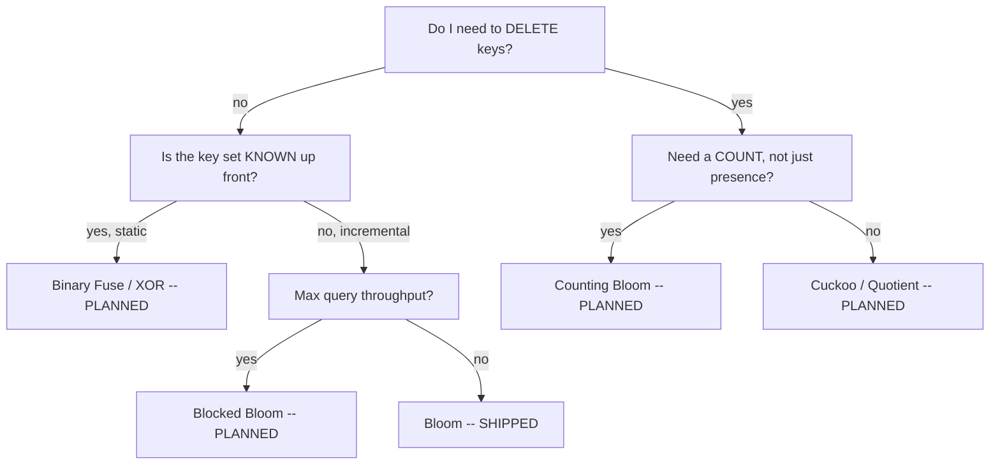

# Which filter do I pick? -- a field guide

> REPO-ONLY. This guide is NOT in the npm tarball (`package.json` `files[]`), exactly
> like lite-lru's `GUIDE.md`. The shipped `README.md` carries the concise table;
> `llms.txt` carries the per-member "good for / not for"; this is the long form with
> the flowchart and the MEASURED numbers.

> SKELETON (v0.1.0). Only Bloom ships today, so most rows below are marked PLANNED --
> they name the axis the member will occupy and are filled in with a MEASURED bench
> number when the member lands (ROADMAP section 10). No un-numbered assertion ships.

## The golden rule

**MEASURE your own keys.** The textbook `fpp = (1 - e^(-kn/m))^k` is a hypothesis,
not your filter's behavior. It assumes independent, uniform hash positions; under a
real key distribution -- especially near-full -- the MEASURED false-positive rate
runs OVER the formula. Every strong claim in this guide must trace to a seeded bench
number produced by THIS repo (`npm run bench`), or else it says "measure your own
keys". An overclaimed FPR or space bound is a REJECT, not a headline.

```bash
npm run bench     # measured vs theoretical FPR, bits/item, add/query ns, per workload
```

## The decision table (each row a hypothesis to TEST, never a verdict)

| Your need | Start with | Why | Status |
| --- | --- | --- | --- |
| Simple, well-understood baseline | **Bloom** | the textbook default; the floor | SHIPPED (v0.1.0) |
| Need deletes | Cuckoo (alt: Counting Bloom) | deletable; Cuckoo better space at low fpp | PLANNED |
| Approximate multiplicity, not just presence | Counting Bloom | counters carry a count | PLANNED |
| Maximum query throughput | Blocked Bloom | one cache miss per query | PLANNED |
| Mergeable / resizable | Quotient | the only member that merges + resizes | PLANNED |
| Known static set, minimize space | Binary Fuse (alt: XOR) | near the ~1.23x lower bound, no inserts | PLANNED |

## The flowchart (scaffold)



## Per-member mental model

### Bloom (SHIPPED)

One bit array of `m` bits, `k` hash positions per key. `add` sets `k` bits;
`mightContain` returns `true` only if all `k` bits are set. It is the ONE-SIDED
floor: no false negatives, false positives bounded by the configured `fpp`. It cannot
delete (clearing bits would break other keys), and it is not the most space-efficient
at very low `fpp` -- that is what the static members exist to improve on. Reach for it
when you want a simple, predictable membership filter and do not need deletes.

*Measured (fill this in from `npm run bench` on your hardware):* uniform / zipfian /
sequential / adversarial near-full -- bits/item, measured FPR, `% over theoretical`.

## Reach-for / avoid (Bloom)

- REACH FOR Bloom when: the key set grows incrementally, you never delete, a ~1%
  target fpp is fine, and simplicity matters more than the last few bits of space.
- AVOID Bloom when: you need deletes (use a deletable member), you need the smallest
  possible space at very low fpp (use a static member), or you need one cache miss
  per query at high throughput (use Blocked Bloom).
