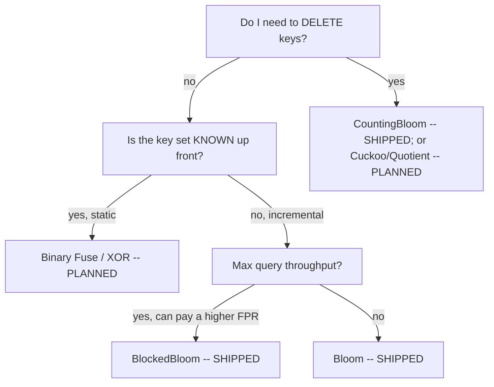

# Which filter do I pick? -- a field guide

> REPO-ONLY. This guide is NOT in the npm tarball (`package.json` `files[]`), exactly
> like lite-lru's `GUIDE.md`. The shipped `README.md` carries the concise table;
> `llms.txt` carries the per-member "good for / not for"; this is the long form with
> the flowchart and the MEASURED numbers.

> SKELETON (v0.3.0). Bloom + CountingBloom + BlockedBloom ship today; the rest are marked PLANNED --
> they name the axis the member will occupy and are filled in with a MEASURED bench
> number when the member lands (ROADMAP section 10). No un-numbered assertion ships.

## The golden rule

**MEASURE your own keys.** The textbook `fpp = (1 - e^(-kn/m))^k` is a hypothesis,
not your filter's behavior. It assumes independent, uniform hash positions; under a
real key distribution -- especially near-full -- the MEASURED false-positive rate
runs OVER the formula. Every strong claim in this guide must trace to a seeded bench
number produced by THIS repo (`npm run bench`), or else it says "measure your own
keys". An overclaimed FPR or space bound is a REJECT, not a headline.

```bash
npm run bench     # measured vs theoretical FPR, bits/item, add/query ns, per workload
```

## The decision table (each row a hypothesis to TEST, never a verdict)

| Your need | Start with | Why | Status |
| --- | --- | --- | --- |
| Simple, well-understood baseline | **Bloom** | the textbook default; the floor | SHIPPED (v0.1.0) |
| Need deletes | **CountingBloom** (alt: Cuckoo) | 4-bit counters decrement; real `remove()` | SHIPPED (v0.2.0) |
| Approximate multiplicity, not just presence | CountingBloom | counters carry a count (readout deferred, decisions/0010) | PARTIAL |
| Maximum query throughput | **BlockedBloom** | one cache miss per query (at a HIGHER measured FPR) | SHIPPED (v0.3.0) |
| Mergeable / resizable | Quotient | the only member that merges + resizes | PLANNED |
| Known static set, minimize space | Binary Fuse (alt: XOR) | near the ~1.23x lower bound, no inserts | PLANNED |

## The flowchart (scaffold)



## Per-member mental model

### Bloom (SHIPPED)

One bit array of `m` bits, `k` hash positions per key. `add` sets `k` bits;
`mightContain` returns `true` only if all `k` bits are set. It is the ONE-SIDED
floor: no false negatives, false positives bounded by the configured `fpp`. It cannot
delete (clearing bits would break other keys), and it is not the most space-efficient
at very low `fpp` -- that is what the static members exist to improve on. Reach for it
when you want a simple, predictable membership filter and do not need deletes.

*Measured (fill this in from `npm run bench` on your hardware):* uniform / zipfian /
sequential / adversarial near-full -- bits/item, measured FPR, `% over theoretical`.

### CountingBloom (SHIPPED)

Bloom with each bit replaced by a 4-bit SATURATING counter, two packed per byte
(decisions/0007): `add` increments, `remove` decrements, `mightContain` is true iff
every probed counter is nonzero. It is the deletable member -- a real
`remove(key) -> boolean` -- at ~4x a plain Bloom's space (4 bits vs 1). Its FPR tracks
the SAME theoretical formula as Bloom (measured `% over theoretical` matches Bloom's
across all four workloads). Two honest caveats to internalize before reaching for it:

- **Only remove keys you actually added.** `remove` runs two passes -- verify all `k`
  counters are nonzero, then decrement -- and returns `false` without mutating if any
  is zero. But if a never-added key happens to be a false positive (all `k` counters
  nonzero via other keys), removing it decrements REAL keys and can cause a later
  false negative (decisions/0009).
- **Saturated counters stick.** A counter that reaches 15 is clamped and never
  decremented again (decisions/0008), so a key routed only through saturated counters
  stays present after removal. At a 1% fpp saturation is negligibly rare, but it is
  real. The multiplicity readout ("how many times added?") is deferred (decisions/0010)
  precisely because saturation + collisions make it an over-estimate.

*Measured (fill this in from `npm run bench`):* the CountingBloom table mirrors
Bloom's FPR columns at 4x bits/item, plus a `remove-churn` line (add N, remove half,
requery) whose `falseNegPresent` MUST be 0 and whose `residual` is the shared-counter
false-positive residue.

### BlockedBloom (SHIPPED)

Bloom partitioned into fixed 512-bit BLOCKS -- 16 x 32-bit words = 64 bytes, one cache
line (decisions/0012). Every key is routed to ONE block (from its first base hash), and
all `k` bits live inside that block via an odd-stride within-block walk. So a query
touches ONE cache line regardless of `k` -- the throughput win the bench shows on the
uniform / sequential / adversarial workloads (query ns DOWN vs Bloom at the SAME
bits/item). It is add-only like Bloom: `remove()` throws.

The caveat is inherent and MEASURED, never hidden (decisions/0013): confining a key to
one block loses the cross-block independence the textbook formula assumes, so its
MEASURED false-positive rate runs OVER a plain Bloom's for the same bits/item. `fpp()`
reports the plain closed-form as a labeled FLOOR, not a prediction. The bench prints
Bloom vs BlockedBloom side by side so the trade -- lower query ns, higher FPR -- is the
first thing you see. To hit a target measured FPR, raise the configured `fpp` slightly
or measure your own keys; never trust the floor as the delivered rate.

*Measured (fill this in from `npm run bench`):* the side-by-side table -- `FPR delta`
(BlockedBloom higher) and `qns delta` (BlockedBloom lower on uniform) across the four
workloads.

## Reach-for / avoid (BlockedBloom)

- REACH FOR BlockedBloom when: query throughput dominates, the key set grows
  incrementally, you never delete, and you can pay a modestly higher (measured) FPR --
  or raise `fpp` to buy it back -- for one cache miss per query.
- AVOID BlockedBloom when: you need the tightest FPR at a given bits/item (plain Bloom
  is lower), you need deletes (CountingBloom), or your working set already fits in cache
  (the locality win shrinks and the FPR penalty is not worth it -- MEASURE).

## Reach-for / avoid (Bloom)

- REACH FOR Bloom when: the key set grows incrementally, you never delete, a ~1%
  target fpp is fine, and simplicity matters more than the last few bits of space.
- AVOID Bloom when: you need deletes (use a deletable member), you need the smallest
  possible space at very low fpp (use a static member), or you need one cache miss
  per query at high throughput (use Blocked Bloom).

## Reach-for / avoid (CountingBloom)

- REACH FOR CountingBloom when: you need real deletes with Bloom's one-sided read
  semantics, you can pay ~4x the space, and you only ever remove keys you added.
- AVOID CountingBloom when: you cannot guarantee removes are of added keys (risk a
  false negative), you need the lowest space per deletable item (prefer Cuckoo,
  PLANNED), or you never delete at all (plain Bloom is 4x smaller).
